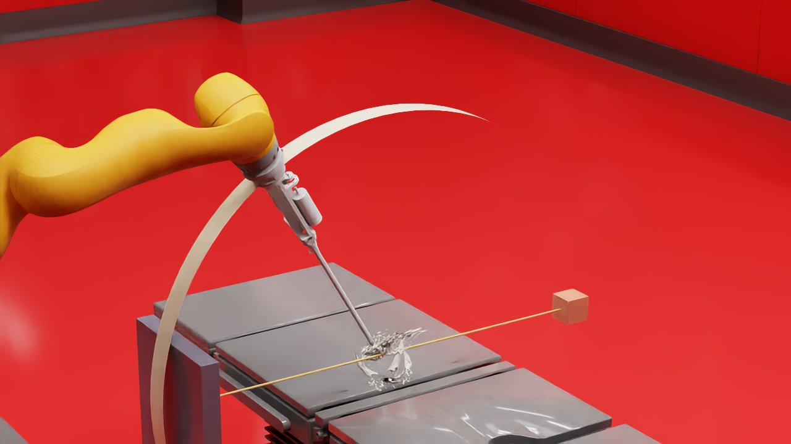
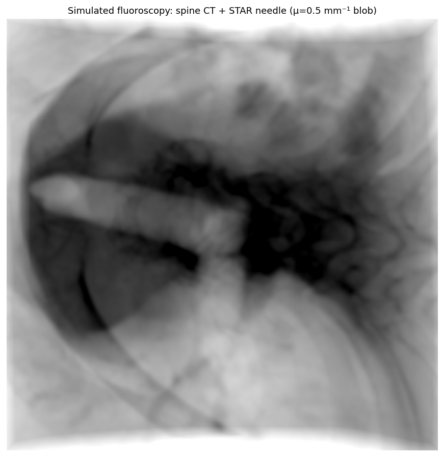
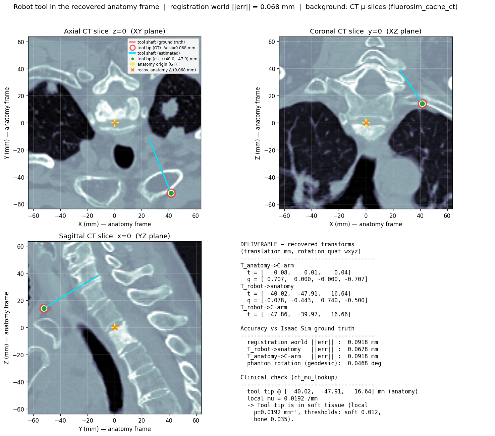
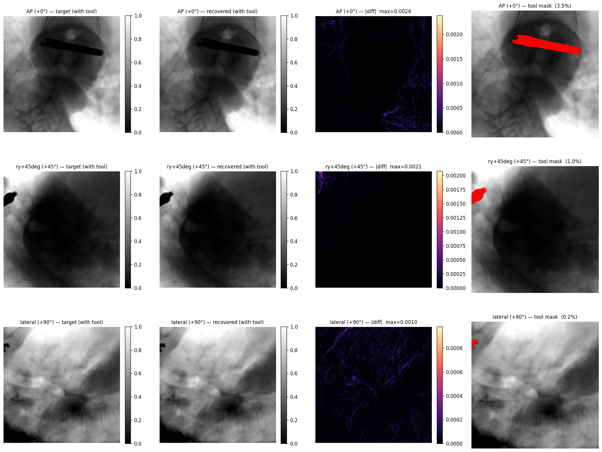

# isaac_roentgen_nav

Fluoroscopy-guided robot pose estimation in Isaac Sim. A virtual surgical scene
with a STAR robot and a CT spine phantom is imaged by a simulated mobile
C-arm; differentiable DRR registration recovers the anatomy pose (position
**and** orientation) from the X-ray images; the recovered pose is composed with
the robot's forward kinematics to produce **T_robot_in_anatomy** — the transform
that intraoperative trajectory planning would consume.

| Surgical scene (STAR + CT spine + C-arm) | Simulated fluoroscopy with tool blob |
|---|---|
|  |  |

The C-arm rotation in the scene drives the registration view direction —
position robot and C-arm in the GUI, capture two (or more) C-arm angles as
separate shots, and the multi-view 6-DOF registration recovers both translation
and phantom orientation from those shots. See the [Quick start](#quick-start--full-end-to-end) below.

**Headline results** — 6-DOF multi-view registration on the real spine CT:

| Volume / scene | Trans ‖err‖ | Rot ‖err‖ | Time |
|---|---|---|---|
| Synthetic ellipsoid + Franka rest pose | **0.07 mm** | — (symmetric, no signal) | ~8 s |
| Real spine CT — cropped 128 mm³ ROI (3-DOF) | **0.037 mm** | — | 9.4 s |
| Real spine CT — 6-DOF, 200 iters | **0.016 mm** | **0.020°** | 15.2 s |
| Real spine CT — full 797×512×512 (3-DOF) | **0.076 mm** | — | 15.6 s |
| Medical scene (STAR + spine on table) | **0.096 mm** | — | ~10 s |
| Medical scene + real endo360 tool mesh in target | **0.004 mm** | **0.000°** | ~47 s |

All on an RTX 4060 Laptop GPU (8 GB VRAM). The full CT volume fits with room to spare.

---

## Goal

The final deliverable is the spatial transform between the robot end-effector
and the patient anatomy — established entirely through simulated fluoroscopy.
Once this transform is known, the surgeon (or a planner) can:

- Know whether the tool tip is inside or outside the bone core
- Plan a trajectory toward a surgical target ("move 5 mm closer to the spine")
- Track tool drift relative to anatomy across multiple imaging instants

Everything runs in simulation for now; the design is structured so that each
component (Isaac Sim → pose.json → fluorosim → registration → transform
composition) maps directly to its real-OR counterpart.

---

## Pipeline

```
   ┌──────────────────────────────────────────────┐
   │  Isaac Sim  (host, headless or GUI)           │
   │                                              │
   │  Robot arm  ─── FK ──► ee_pos, ee_quat        │
   │  Phantom    ─── USD ──► phantom_pos, quat     │
   │  C-arm      ─── GUI ──► shot angles list      │
   │                                              │
   │  → pose.json  (written per step or on demand) │
   └──────────────────┬───────────────────────────┘
                      │
                      ▼
   ┌──────────────────────────────────────────────┐
   │  fluorosim  (Docker, GPU)                    │
   │                                              │
   │  ➊  Render target DRR per captured C-arm angle │
   │  ➋  6-DOF optimizer (Adam):                  │
   │       shared translation  (3 DOF, mm)        │
   │       shared phantom_rot  (3 DOF, ZXY Euler) │
   │       per-view: t_eff = R_ph.T @ t_world     │
   │                 R_eff = R_ph.T @ R_gantry    │
   │       summed MSE · Slang autodiff · Adam      │
   │  → recovered phantom_pos + phantom_quat       │
   └──────────────────┬───────────────────────────┘
                      │
                      ▼
   ┌──────────────────────────────────────────────┐
   │  Post-processing  (host, pure Python)        │
   │                                              │
   │  T_R^W  ← ee_pos / ee_quat  (FK, always known) │
   │  T_C^W  ← carm_pos / quat   (calibration)    │
   │  T_A^W  ← registered phantom_pos + quat      │
   │                                              │
   │  T_R^A = inv(T_A^W) · T_R^W                   │
   │  T_R^C, T_A^C   (all three transforms)       │
   │  Clinical: EE inside/outside bone core?      │
   └──────────────────────────────────────────────┘
```

`pose.json` carries every world-frame pose (EE, C-arm, phantom) as the IPC
contract between Isaac Sim and the fluorosim container. The registration
recovers `translation_mm = (carm_pos − phantom_pos) × 1000` and
`phantom_rot` (ZXY Euler), which together give the full 6-DOF anatomy pose
relative to the C-arm — the real unknown in any fluoroscopy-guided procedure.

---

## Clinical faithfulness

> *Are we feeding the registration information that a real OR wouldn't have
> — especially the phantom isocenter pose?*

**Short answer: no.** The `phantom_pos` field in `pose.json` is used in
two roles that are easy to conflate but are distinct:

| Use of `phantom_pos` | Role | Real-life analog |
|---|---|---|
| fluorosim renders target DRRs at this pose | Where the anatomy sits in the simulated world | The physical patient — no "knowledge" required, the X-ray hits it regardless |
| `compute_robot_to_anatomy.py` compares GT vs recovered | Accuracy scoring | An independent precision measurement (optical tracker, CMM) — present only for evaluation |

The optimizer never reads `phantom_pos`. It sees only the CT μ-volume, the
target images, and an initial translation guess. Convergence to 16 µm / 0.02°
is recovery from the images alone.

Full input audit:

| Input | Sim source | Real-OR source | Realistic? |
|---|---|---|---|
| Robot EE pose | Isaac Sim FK | Joint encoders → FK | ✓ |
| C-arm pose | Set in `pose.json` | Hand-eye calibration C-arm ↔ robot (one-time) | ✓ |
| C-arm gantry angle per shot | Captured from USD prim | Gantry encoders | ✓ |
| CT μ-volume | Real DICOM spine CT or synthetic cache | Pre-op CT, segmented HU→μ | ✓ (mechanism identical) |
| Target X-ray | Rendered by fluorosim | Actual X-ray photons | ✓ (same Beer–Lambert physics) |
| Optimizer initial guess | C-arm isocenter + `INIT_OFFSET_MM` | Planning prior or "anatomy at isocenter" | ✓ blind — never derived from GT (GT used only to score) |
| Ground-truth phantom pose (for scoring) | `pose.json` | Sim-only — NOT used by the optimizer | Validation reference only |

---

## Hardware

- NVIDIA RTX 4060 Laptop (8 GB VRAM, CC 8.9), AMD Ryzen 7 7840HS, 32 GB RAM
- Ubuntu 22.04, NVIDIA Driver 590.48, CUDA 13.1 host / 12.6 container

## Software stack

- **Isaac Sim 4.5.0** (standalone at `~/isaacsim/`)
- **fluorosim** (NVIDIA i4h-sensor-simulation) — differentiable DRR renderer
- **fluorosim-torch** — derived image (`bridge/fluorosim_torch.Dockerfile`)
  adding PyTorch 2.5.1+cu121 for the registration optimizer
- Host-side Python: `numpy`, `matplotlib`, `pyzmq`, `Pillow` — see
  [`pyproject.toml`](pyproject.toml)

---

## Installation

```bash
# 1. Install Isaac Sim 4.5.0 standalone (per NVIDIA docs)

# 2. Build fluorosim base image (outside this repo)
mkdir -p ~/nvidia-third-party && cd ~/nvidia-third-party
git clone https://github.com/isaac-for-healthcare/i4h-sensor-simulation.git
cd i4h-sensor-simulation/fluoro-simulator && docker build -t fluorosim .

# 3. Build the torch-enabled derivative (~5 min, one-time)
docker build -t fluorosim-torch \
    -f ~/isaac_projects/bridge/fluorosim_torch.Dockerfile \
    ~/isaac_projects/bridge/

# 4. Install pyzmq into Isaac Sim's embedded Python (not your conda env)
/home/$USER/isaacsim/kit/python/bin/python3 -m pip install pyzmq \
    --target /home/$USER/isaacsim/kit/python/lib/python3.10/site-packages

# 5. Host-side glue
pip install -e .
```

---

## Quick start — full end-to-end

### Workflow 0 — one button (recommended)

Pose the STAR robot's needle near the spine in the open `medical_scene.usd`
GUI, then run a single command. `bridge/register_oneshot.py` chains all three
stages — it sweeps the C-arm to each view angle in the live scene (capture),
runs the 6-DOF multi-view registration in Docker (register), and composes the
transforms (compose) — then prints `T_A^C / T_R^A / T_R^C`, the registration
error, and the clinical check.

```bash
conda deactivate
cd ~/isaac_projects

python3 bridge/register_oneshot.py                 # real spine CT, 3 views (0/45/90)
python3 bridge/register_oneshot.py --full-ct       # full CT volume (best accuracy)
python3 bridge/register_oneshot.py --noise         # realistic target DRR noise
python3 bridge/register_oneshot.py --no-capture    # reuse existing pose.json (skip the GUI)
python3 bridge/register_oneshot.py --no-plot       # skip the deliverable figure
python3 bridge/register_oneshot.py --synthetic --views 0,60,120 --n-iters 250
```

Every run writes `output/robot_to_anatomy.json` and the deliverable figure
`output/robot_to_anatomy_layout.png` (unless `--no-plot`):



*Three orthogonal CT planes (axial / coronal / sagittal) through the anatomy
isocenter, with the **estimated** tool drawn as an oriented needle (green tip +
cyan shaft) recovered purely from the X-ray registration. The **ground-truth**
tool (red open circle + dashed shaft, from Isaac Sim) is overlaid for
validation — at this accuracy the two coincide (`Δest` in the legend). The text
panel reports the three recovered transforms, the per-transform error vs ground
truth, and the data-driven inside-bone / soft-tissue check. In a real procedure
only the green estimate exists; the red overlay is a simulation-only accuracy
reference.*

The stages below (Workflows A / B) are the same pipeline run by hand — useful
when you want to inspect or tweak an individual step.

### Workflow A — medical scene + real CT + GUI-driven C-arm (the demo)

```bash
conda deactivate   # Isaac Sim clashes with conda's site-packages
cd ~/isaac_projects

# Open scenes/medical_scene.usd in the Isaac Sim GUI first.
# Pose the STAR robot's needle near the spine using the GUI manipulators.

# Capture three shots (0°, 45°, 90°). The oblique 45° view breaks the
# in-plane tx<->ry coupling that stalls blind 6-DOF with only two views.

# View 1 — AP (0°); RESET_SHOTS clears any prior shot list
python3 scenes/isaacsim_client.py "CARM_ROTATION_DEG=0
$(cat scenes/rotate_carm.py)"
python3 scenes/isaacsim_client.py "RESET_SHOTS=1
$(cat scenes/add_carm_shot.py)"

# View 2 — oblique (45°)
python3 scenes/isaacsim_client.py "CARM_ROTATION_DEG=45
$(cat scenes/rotate_carm.py)"
python3 scenes/isaacsim_client.py < scenes/add_carm_shot.py

# View 3 — lateral (90°)
python3 scenes/isaacsim_client.py "CARM_ROTATION_DEG=90
$(cat scenes/rotate_carm.py)"
python3 scenes/isaacsim_client.py < scenes/add_carm_shot.py

# 6-DOF multi-view registration (200 iters for full accuracy)
DICOM_PATH=~/medical_imaging/spine_mets_ct_seg/10250/04098/27242 \
  USE_POSE_JSON=1 USE_CARM_ROTATION=1 N_ITERS=200 \
  bridge/run_register_multiview.sh

# Compose T_robot_in_anatomy + inside-bone clinical check
python3 bridge/compute_robot_to_anatomy.py

# Optional: render a single DRR with the tool blob visible (for demos)
DICOM_PATH=~/medical_imaging/spine_mets_ct_seg/10250/04098/27242 \
  bridge/run_fluorosim.sh
```

### Optional: build the real-tool stamp (one-time per tool geometry)

The registration target DRRs auto-include the real endo360 tip + a synthetic
shaft when `output/tool_stamp.npy` exists; without it the painter falls back
to a sphere. Build the stamp once after the STAR robot is loaded in the
scene:

```bash
# (1) Extract the endo360 tip mesh from the live scene into EE-local mm:
python3 scenes/isaacsim_client.py < scenes/extract_tool_mesh.py

# (2) Voxelize (host-side; needs `pip install trimesh rtree`):
python3 bridge/build_tool_stamp.py
# Defaults: 50 mm × 5 mm synthetic shaft → ~100 mm tool, 0.5 mm spacing.
# Bigger tool (more clinical-looking) → 250 mm total:
#   SHAFT_LENGTH_MM=200 python3 bridge/build_tool_stamp.py
# No synthetic shaft (real tip mesh only):
#   SHAFT_LENGTH_MM=0   python3 bridge/build_tool_stamp.py
# Disable tool entirely at registration time:
#   TOOL_IN_TARGET=0 bridge/run_register_multiview.sh
```

### Workflow B — headless smoke test (Franka + synthetic phantom)

The original Z-up world without an OR around it. Useful for regression
testing the pipeline math without GUI involvement.

```bash
# Step 1 — build the simulated scene and write pose.json (~25 s)
~/isaacsim/python.sh scenes/robot_scene.py

# Step 2 — sequential AP + lateral registration (~8 s, 3-DOF default)
bridge/run_register_multiview.sh

# Step 3 — compose T_robot_in_anatomy from registration + FK
python3 bridge/compute_robot_to_anatomy.py
```

`compute_robot_to_anatomy.py` prints the headline result and writes
`output/robot_to_anatomy.json` + `output/robot_to_anatomy_layout.png`.

### Optional: pre-warm the CT cache (one-time)

```bash
bridge/run_load_ct.sh                       # cropped 128 mm³ ROI (~10 s)
CT_FULL_VOLUME=1 bridge/run_load_ct.sh      # full 797×512×512 (~20 s)
```

### Optional: single-view baseline (for comparison)

```bash
bridge/run_register.sh           # AP only → ~0.4 mm (depth ambiguity present)
python3 bridge/plot_registration.py
```

### Live introspection via Isaac Sim TCP

```bash
# Verify EE pose and phantom prims in a running GUI session
python3 scenes/isaacsim_client.py < scenes/verify_pose.py
python3 scenes/isaacsim_client.py < scenes/verify_phantom.py

# Capture a viewport snapshot
python3 scenes/isaacsim_client.py "$(cat scenes/image_publisher.py)"
python3 scenes/take_snapshot.py my_snapshot.jpg
```

---

## Results

### Multi-view vs single-view

A single AP shot cannot resolve translation along the X-ray beam axis (depth
ambiguity). The 90° lateral shot collapses it:

| Method | x err | y err | **z err** | ‖err‖ |
|---|---|---|---|---|
| Single view (AP only) | 0.04 mm | 0.02 mm | **0.41 mm** | 0.41 mm |
| **AP + Lateral (sequential)** | 0.04 mm | −0.03 mm | **0.01 mm** | **0.05 mm** |

Z is the *most-constrained* axis with two views because it is in-plane in the
lateral view and its gradient is strong there.

### 6-DOF registration — translation + rotation

The optimizer jointly recovers phantom translation and orientation (3 + 3 DOF)
using a shared `phantom_rot` (ZXY Euler) parameter. Per-view composition
ensures each rendered DRR uses the correct effective viewing angle through the
rotated anatomy. The rotation backward path in Slang's autodiff produces NaN
in some configurations; these are detected and zeroed out so the optimizer
continues cleanly.

On the real spine CT with `N_ITERS=200` (needed to untangle the
rotation-translation coupling):

| | Init | Final |
|---|---|---|
| Translation ‖err‖ | 19.7 mm | **0.016 mm** |
| Rotation ‖err‖ (geodesic) | 5.83° | **0.020°** |
| Wall time | — | 15.2 s (76 ms/iter) |


*Left to right: total MSE loss, per-view loss (AP / lateral), translation error
per axis, rotation error per axis. The optimizer oscillates until ~iter 120 as
rotation and translation untangle, then converges sharply.*


*AP (top) and lateral (bottom): target | recovered | |diff|. The |diff| max of
0.015 (AP) and 0.010 (lateral) is near the noise floor of the differentiable
renderer.*

### Real tool in the registration target — clinical fluoroscopy realism

The target images now look like an actual intra-op X-ray with the endoscope
inserted. The endo360 tip mesh is extracted from the live Isaac Sim scene into
an EE-local voxel stamp (`scenes/extract_tool_mesh.py` →
`bridge/build_tool_stamp.py`); at registration time the stamp is splatted into
the μ-volume at the current EE pose, the steel tool occludes the underlying
anatomy, and a per-view tool mask zeros out the tool's pixels in the loss so
the optimizer matches anatomy only. After convergence the recovered DRR is
re-rendered with the tool at the *recovered* EE voxel — at sub-voxel agreement
with the target, the two look identical.



*Three rows = three C-arm angles (AP / 45° / 90°). Columns = target with tool |
recovered with tool | |diff| | tool mask used in the loss. The dark elongated
opacity is the real endoscope tip + a synthetic shaft extension (the housing
beyond ~100 mm is mostly outside even the full CT volume and gets silently
clipped — see the project log). Mask coverage varies dramatically per view
(3.5% AP / 1.0% oblique / 0.2% lateral) which is the visual cue a surgeon uses
to recognize the tool from any C-arm angle.*

Three tool-scope options, all converging to sub-µm from a 19.7 mm / 5.8° blind
start on the live medical scene + full CT, 200 iters:

| Tool scope | Final ‖t_err‖ | Final ‖r_err‖ | Wall time | AP mask |
|---|---|---|---|---|
| `none` (no tool painting) | **0.0003 mm** | 0.0000° | 47 s | — |
| `current` (real tip + 50 mm synthetic shaft, 100 mm) | **0.0037 mm** | 0.0000° | 47 s | 2.4% |
| `big` (real tip + 200 mm synthetic shaft, 250 mm) | **0.0039 mm** | 0.0000° | 45 s | 3.5% |

Tool-driven DRR↔robot pose refinement is the natural follow-on: a tool-only
differentiable render against the same μ-volume already exists (it's how the
mask is built), so a gradient against the EE pose itself would pull the
robot's hand to match the X-ray silhouette — closing the loop between
fluoroscopic anatomy localization and robot-side calibration.

### Blind initialization and the need for a third view

The optimizer is initialized **without any knowledge of the ground-truth
anatomy pose** — it starts from the C-arm isocenter plus a fixed planning
offset (`INIT_OFFSET_MM`), exactly as a real procedure would (the C-arm is
parked roughly over the patient; the true anatomy pose is the unknown being
solved for). Ground truth is used only to *score* the result.

Validated end-to-end on a live Isaac Sim scene: the C-arm was physically moved
**+30 mm** off the spine in the GUI, captured to `pose.json`, and registered on
the real spine CT from a genuinely blind 28 mm start.

This honest setup surfaced a real property of two-view 6-DOF registration:

| Views | Trans ‖err‖ | Rot ‖err‖ | Outcome |
|---|---|---|---|
| AP + lateral (0°, 90°) | 2.06 mm | 6.15° | **stuck** — in-plane tx↔ry coupling local minimum |
| AP + **oblique** + lateral (0°, 45°, 90°) | **0.003 mm** | **0.000°** | clean convergence |

Two orthogonal views leave an ambiguity between in-plane translation and
rotation (a few-mm shift looks almost identical to a few-degree rotation in
both projections); the depth offset is recovered but `tx`/`ry` drift together.
A single oblique view breaks it. **Three views (one oblique) is therefore the
default and recommended workflow for robust blind 6-DOF registration** —
`VIEWS_DEG_Y` defaults to `0,45,90`. (The two-view case is still fine when the
starting pose is already close to the answer.)

### T_robot_in_anatomy — end-to-end on a real Isaac Sim scene

```
T_robot_in_anatomy.t  (mm)
         Ground truth:  [  0.623,  15.397,  -2.932 ]
            Recovered:  [  0.659,  15.363,  -2.919 ]
     Per-axis error:    [  0.036,  -0.033,   0.013 ]
         ‖error‖:       0.051 mm

Clinical: Tool tip is INSIDE the bone core (normalized distance 0.77).
```

### Simulation simplifications — both previously known gaps are now closed

The two places where the simulation used to be more permissive than a clinical
setting have both been addressed without changing the registration algorithm
itself; only the input realism changed:

1. **Tool in the registration target image** — ✅ *fixed (Phase 5l + 5m)*.
   The target DRRs now show the real endo360 tip mesh (extracted from the live
   STAR robot) plus a synthetic shaft, so they look like fluoroscopy with the
   tool inserted. A per-view tool mask, derived from a tool-only differentiable
   render of the same μ-volume, zeros the tool's pixels out of the loss so the
   optimizer only matches anatomy. See [Real tool in the registration target](#real-tool-in-the-registration-target--clinical-fluoroscopy-realism)
   above for the images and numbers.
2. **Optimizer initialization** — ✅ *fixed*. The optimizer starts from the
   C-arm isocenter plus a fixed planning offset; ground truth is used only for
   scoring, never construction. See [Blind initialization](#blind-initialization-and-the-need-for-a-third-view)
   above.

---

## Project layout

```
isaac_roentgen_nav/
├── scenes/                            # Isaac Sim — scene scripts + host tooling
│   ├── robot_scene.py                 # headless: Franka + phantom, writes pose.json
│   ├── phantom.py                     # shared phantom geometry (single source of truth)
│   ├── medical_scene.usd              # OR scene — table, STAR, CT spine, C-arm
│   ├── inject_medical_scene.py        # TCP-injected: builder for medical_scene.usd
│   ├── pose_from_medical_scene.py     # TCP-injected: live stage → pose.json (metres)
│   ├── add_carm_viz.py                # TCP-injected: build /World/CArm visualisation
│   ├── rotate_carm.py                 # TCP-injected: rotate C-arm around patient axis
│   ├── add_carm_shot.py               # TCP-injected: append C-arm angle to view list
│   ├── capture_two_shots.py           # TCP-injected: timed two-shot capture (GUI)
│   ├── verify_pose.py                 # TCP-injected: EE pose vs pose.json
│   ├── verify_phantom.py              # TCP-injected: phantom prim world transform
│   ├── extract_tool_mesh.py           # TCP-injected: endo360 mesh → EE-local mm
│   ├── isaacsim_client.py             # TCP client for VSCode extension socket
│   ├── image_publisher.py             # TCP-injected: ZMQ JPEG viewport stream
│   └── take_snapshot.py               # ZMQ subscriber: save one frame
├── bridge/                            # fluorosim side + post-processing
│   ├── fluorosim_render.py            # in-container: pose.json → DRR (tool painted)
│   ├── run_fluorosim.sh               # docker run wrapper
│   ├── visualize_drr.py               # host: annotated viewer + sanity check
│   ├── fluorosim_torch.Dockerfile     # fluorosim + PyTorch 2.5.1+cu121
│   ├── register_phantom.py            # single-view 6-DOF registration
│   ├── run_register.sh                # wrapper for single-view
│   ├── plot_registration.py           # host: single-view convergence plots
│   ├── register_phantom_multiview.py  # multi-view 6-DOF registration (primary)
│   ├── run_register_multiview.sh      # wrapper for multi-view
│   ├── plot_registration_multiview.py # host: 4-panel convergence + image grid
│   ├── register_oneshot.py            # host: ONE-BUTTON capture → register → compose
│   ├── compute_robot_to_anatomy.py    # host: registration → T_R^A, T_R^C, T_A^C + figure
│   ├── plot_capture_range.py          # host: basin-of-attraction curve + scatter
│   ├── build_tool_stamp.py            # host: voxelize EE-local mesh → tool_stamp.npy
│   ├── ct_loader.py                   # DICOM CT → PreprocessedVolume (cropped or full)
│   └── run_load_ct.sh                 # one-time CT cache builder
├── docs/images/                       # committed reference images for this README
├── output/                            # runtime artifacts — gitignored
├── CLAUDE.md                          # detailed implementation log, gotchas
├── pyproject.toml
├── LICENSE                            # Apache-2.0
└── README.md
```

---

## Status

**Done:**

- **Phase 1** — Isaac Sim headless scene; Franka EE pose readable
- **Phase 2** — fluorosim Docker; differentiable DRR at ~150 FPS
- **Phase 2.5** — TCP code-injection + ZMQ viewport snapshot tooling
- **Phase 3** — `pose.json` IPC; full Isaac Sim → fluorosim → DRR loop
- **Phase 4** — Shared phantom geometry; world↔isocenter transform verified
  numerically; robot tool painted into μ-volume and visible in DRR
- **Phase 5** — Translation-only registration; single-view (0.41 mm) and
  multi-view (0.05 mm); `compute_robot_to_anatomy.py` produces T_R^A;
  end-to-end test on a live Isaac Sim scene
- **Phase 5d** — Real DICOM CT integration: `bridge/ct_loader.py` loads a
  797-slice spine CT via SimpleITK; `DICOM_PATH` + `CT_FULL_VOLUME` env vars
  select real CT vs synthetic and cropped vs full volume
- **Phase 5e** — Isaac Sim CT mesh: `bridge/ct_to_mesh.py` extracts a triangle
  mesh (marching cubes + Laplacian smoothing), loaded as `UsdGeom.Mesh`
- **Phase 5f** — `USE_POSE_JSON=1` loop closed on the CT phantom;
  `compute_robot_to_anatomy.py` does data-driven inside-bone classification via
  μ-volume lookup; layout PNG shows CT slices through isocenter
- **Phase 5g** — Tool-in-DRR on the real CT: EE blob painted into spine
  μ-volume for demo rendering
- **Phase 5h** — Surgical scene (`scenes/medical_scene.usd`): operating
  table, STAR robot, CT spine mesh; STAR holds pose via authored joint drives
- **Phase 5i** — C-arm USD visualisation sized to fluorosim SDD/SID geometry;
  correct AP→lateral sweep around patient long axis
- **Phase 5j** — Two-shot / N-shot C-arm capture workflow (`add_carm_shot.py`,
  `capture_two_shots.py`); registration reads the captured angle list directly
- **Phase 5k** — **6-DOF registration**: jointly optimizes phantom translation
  (3 DOF) and orientation (3 DOF). On real spine CT: **0.016 mm / 0.020°** in
  200 iters (15.2 s). Backward-compatible: set `INIT_ROT_DEG="0,0,0"` to
  revert to 3-DOF translation-only mode
- **Blind initialization** — the optimizer no longer uses ground truth to
  construct its starting pose; it inits from the C-arm isocenter + planning
  offset only. Validated on a live scene with a +30 mm off-isocenter C-arm.
  Exposed (and fixed, via a third oblique view) the two-view tx↔ry coupling:
  3 views → **0.003 mm / 0.000°** from a 28 mm blind start
- **Phase 5l — Tool in the registration target image.** Paints an
  EE-positioned tool occluder (μ ≈ 0.3 mm⁻¹, ≈ stainless steel @ 60 keV) into
  the target μ-volume so the rendered fluoroscopy looks clinical. A tool-only
  differentiable render of the same volume gives a per-view binary mask
  (`occlusion > 0.5`); the loss is `((rendered − target)² · (1 − mask))`
  averaged over anatomy pixels only — the optimizer matches anatomy in spite
  of the visible tool, just like a real clinical workflow with tool
  segmentation
- **Phase 5m — Real endo360 tool mesh in the DRR.** Three-stage pipeline
  splits across the environments that have what's needed:
  `scenes/extract_tool_mesh.py` (TCP-injected into Isaac Sim) writes the
  endo360 tip mesh into EE-local mm; `bridge/build_tool_stamp.py` (host-side
  with `trimesh`) voxelizes it into a small μ-stamp with an optional
  synthetic shaft extension; `paint_stamp_into_mu()` in the registration
  script splats the stamp into the phantom μ-volume via
  `scipy.ndimage.affine_transform`. End-to-end on the live medical scene +
  full CT: **0.004 mm / 0.000°** from a blind 19.7 mm / 5.8° start
- **Phase 5n — Validation realism + capture range.** `DRR_NOISE=1` perturbs the
  target DRRs (PSF blur + Poisson photon noise + scatter) so the optimizer can
  no longer exactly reproduce them, breaking the "inverse crime" that made the
  headline errors sub-µm. `CAPTURE_RANGE=1` sweeps controlled init offsets from
  the known pose and records the basin of attraction (`plot_capture_range.py`)
- **Phase 5o — One-button driver.** `bridge/register_oneshot.py` chains
  capture → register → compose from a single command and prints all three
  transforms; `compute_robot_to_anatomy.py` now emits a 4-panel **deliverable
  figure** (axial/coronal/sagittal CT with the estimated tool needle + a
  ground-truth overlay + transform/clinical text panel). `--no-plot` skips it

**Next:**

- **Tool-driven DRR ↔ robot pose refinement** — the tool-only render +
  per-view mask machinery from Phase 5l already gives the tool's silhouette
  as a differentiable image. A gradient on `ee_pos` / `ee_quat` against the
  observed tool silhouette in the target X-ray would *recover* the robot's
  hand pose from fluoroscopy alone — refining FK with a feedback term and
  closing the loop between fluoroscopic anatomy and robot-side calibration
- **Trajectory planning** — consume T_R^A to drive the robot toward a
  surgical target while keeping the tool tip inside a safety region

---

## Acknowledgments

- [NVIDIA i4h — Sensor Simulation](https://github.com/isaac-for-healthcare/i4h-sensor-simulation) — fluorosim differentiable DRR renderer
- NVIDIA Isaac Sim 4.5.0 — physics simulation, USD, Franka asset

## License

Apache-2.0. See [LICENSE](LICENSE).
