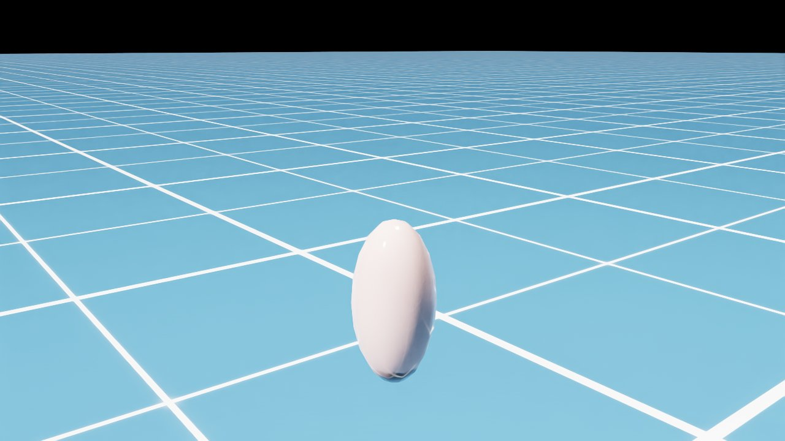
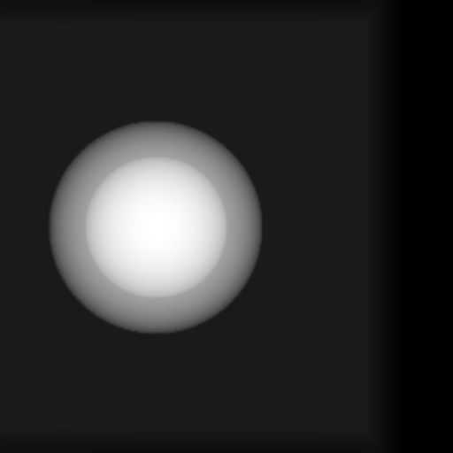

# Fluoroscopy-Based Robot Pose Estimation in Isaac Sim

Simulation pipeline that estimates a robot's pose relative to anatomy using
simulated fluoroscopy (DRR) and 2D/3D CT registration — entirely in software.

The longer-term goal: place a phantom, a robot, and a C-arm in a single scene,
render an X-ray of the phantom + robot tool, and recover the spatial
relationship between the robot and the anatomy by registering the rendered
DRR against the CT volume. This relationship would then drive trajectory
planning (e.g. "move closer to the spine").

| Phantom in Isaac Sim | DRR (C-arm at isocenter) | DRR (C-arm shifted +20 mm in X) |
| --- | --- | --- |
|  |  |  |

## Architecture

```
Isaac Sim (host)           pose.json           fluorosim (Docker)
┌───────────────────┐      ─────────►     ┌───────────────────────┐
│ Franka + phantom  │                     │ Differentiable DRR    │
│ writes EE pose,   │   ◄─────────        │ from synthetic μ-vol  │
│ phantom pose,     │     drr.png         │ via Slang autodiff    │
│ C-arm pose        │     drr_meta.json   │ (Beer-Lambert)        │
└───────────────────┘                     └───────────────────────┘
        ▲                                            ▲
        │  TCP :8226 (Claude Code / VSCode ext)     │
        │  ZMQ :5556 (viewport JPEG stream)         │
        ▼                                            │
   verify_pose.py                                    │
   verify_phantom.py             visualize_drr.py ◄──┘
```

`pose.json` is the contract between the two processes. It contains the
end-effector pose, the phantom isocenter pose, and the C-arm pose — all in
the Isaac Sim world frame. The fluorosim side applies a world→isocenter
transform (`translation_mm = (carm_pos - phantom_pos) * 1000`) before feeding
the result into the differentiable renderer.

## Hardware Used for Development

- NVIDIA RTX 4060 Laptop (8 GB VRAM, CC 8.9), AMD Ryzen 7 7840HS, 32 GB RAM
- Ubuntu 22.04 LTS, NVIDIA Driver 590.48.01, CUDA 13.1 (driver) / 12.6 (container)

The pipeline runs comfortably on this hardware. Larger CT volumes (>256³) may
exceed 8 GB VRAM; the synthetic phantom used here is 128×256×256.

## Software Stack

- **Isaac Sim 4.5.0** (standalone install at `~/isaacsim/`)
- **Docker + NVIDIA Container Toolkit** for fluorosim
- **fluorosim** (NVIDIA `i4h-sensor-simulation`) — runs inside its own Docker
  image, isolated from Isaac Sim. Kept outside this repo at
  `~/nvidia-third-party/i4h-sensor-simulation/`.

Host-side Python dependencies are intentionally minimal — see
[`pyproject.toml`](pyproject.toml). The heavy lifting happens inside Isaac
Sim's embedded Python and inside the fluorosim Docker image.

## Installation

```bash
# 1. Install Isaac Sim 4.5.0 standalone -> ~/isaacsim/   (see NVIDIA docs)

# 2. Clone & build fluorosim outside this repo
mkdir -p ~/nvidia-third-party
cd ~/nvidia-third-party
git clone https://github.com/isaac-for-healthcare/i4h-sensor-simulation.git
cd i4h-sensor-simulation/fluoro-simulator
docker build -t fluorosim .

# 3. Install pyzmq into Isaac Sim's embedded Python (NOT into your conda env)
/home/$USER/isaacsim/kit/python/bin/python3 -m pip install pyzmq \
    --target /home/$USER/isaacsim/kit/python/lib/python3.10/site-packages

# 4. Host-side glue dependencies
pip install -e .
```

## Quick Start

End-to-end run (Isaac Sim is headless; fluorosim runs in Docker). All
commands assume your CWD is the project root and that conda is **not**
active — Isaac Sim's embedded Python clashes with conda's site-packages.

```bash
conda deactivate              # if you're in a conda env
cd ~/isaac_projects           # repo root

# 1. Write a pose.json from the simulated Franka + phantom scene.
#    Takes ~25-30s; most of it is Isaac Sim asset loading.
~/isaacsim/python.sh scenes/robot_scene.py

# 2. Render a DRR from that pose. run_fluorosim.sh is a HOST-side wrapper
#    that runs `docker run --gpus all fluorosim ...` internally — do NOT
#    enter the container yourself first.
bridge/run_fluorosim.sh

# 3. Annotate the DRR and run a flat-image sanity check.
python3 bridge/visualize_drr.py
```

Outputs land in `output/` (gitignored):
- `pose.json` — written by Isaac Sim each simulation step
- `drr.png`, `drr.npy`, `drr_meta.json` — written by fluorosim
- `drr_annotated.png` — DRR with pose overlay
- `fluorosim_cache/` — preprocessed μ-volume cache (persists across runs)

### Live introspection (Claude Code / VSCode extension)

A running Isaac Sim GUI exposes a TCP code-injection socket at `127.0.0.1:8226`
(set by the bundled `isaacsim.code_editor.vscode` extension). Two thin helpers
use this to read live state:

```bash
python3 scenes/isaacsim_client.py < scenes/verify_pose.py     # live EE pose vs pose.json
python3 scenes/isaacsim_client.py < scenes/verify_phantom.py  # phantom prim world transforms
```

A second injection-based helper streams viewport frames as JPEG over ZMQ
(`tcp://127.0.0.1:5556`) for headless snapshots:

```bash
python3 scenes/isaacsim_client.py "$(cat scenes/image_publisher.py)"  # start the stream
python3 scenes/take_snapshot.py snapshot.jpg                          # grab one frame
```

## Project Layout

```
isaac_roentgen_nav/
├── scenes/                     # Isaac Sim (host-side, USD scenes & tooling)
│   ├── robot_scene.py          # headless scene: Franka + phantom, writes pose.json
│   ├── phantom.py              # shared phantom geometry (single source of truth)
│   ├── verify_pose.py          # TCP-injected: compare live EE pose to pose.json
│   ├── verify_phantom.py       # TCP-injected: check phantom prim world transform
│   ├── isaacsim_client.py      # TCP client for the VSCode extension socket
│   ├── image_publisher.py      # injected: ZMQ viewport JPEG stream
│   └── take_snapshot.py        # SUB-side: save one frame from the stream
├── bridge/                     # fluorosim side (runs inside Docker / wraps it)
│   ├── fluorosim_render.py     # reads pose.json, renders DRR
│   ├── run_fluorosim.sh        # docker run wrapper with the right bind mounts
│   └── visualize_drr.py        # annotated viewer + sanity check
├── docs/images/                # reference screenshots used in README
├── output/                     # runtime artifacts (gitignored)
├── CLAUDE.md                   # implementation notes, gotchas, full state log
├── pyproject.toml              # host-side Python metadata
├── LICENSE                     # Apache-2.0
└── README.md                   # you are here
```

## Status

Implemented:

- **Phase 1** — Isaac Sim scene with Franka, EE pose readable headless
- **Phase 2** — fluorosim Docker image, differentiable DRR rendering at ~155 FPS
- **Phase 2.5** — Claude Code ↔ Isaac Sim TCP/ZMQ tooling (code injection +
  viewport snapshots)
- **Phase 3** — Pose-file IPC: Isaac Sim writes `pose.json`, fluorosim renders
  a DRR from it
- **Phase 4 (in progress)** — Synthetic ellipsoid phantom in Isaac Sim,
  world↔isocenter transform verified (centered DRR at isocenter; +20 mm X
  shift produces exactly the expected −80 px detector offset)

Next:

- Make the Franka tool contribute to attenuation (visible in DRR)
- Replace analytic ellipsoid with a marching-cubes mesh from a real CT phantom
- 2D/3D registration via fluorosim's Slang autodiff (Phase 5)

See [`CLAUDE.md`](CLAUDE.md) for the detailed implementation history, design
decisions, and the running list of gotchas.

## Acknowledgments

- [NVIDIA Isaac for Healthcare (i4h) — Sensor Simulation](https://github.com/isaac-for-healthcare/i4h-sensor-simulation)
  — provides the fluorosim differentiable DRR renderer used in this pipeline.

## License

Apache-2.0. See [LICENSE](LICENSE).
