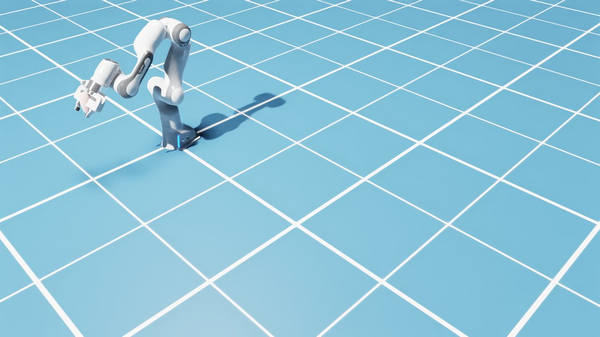
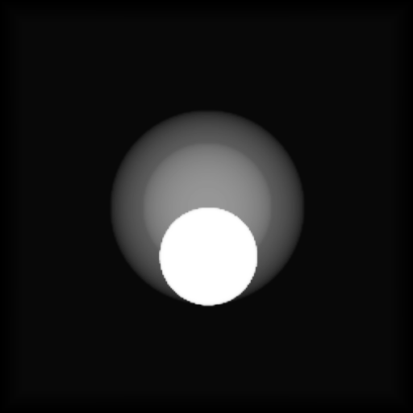
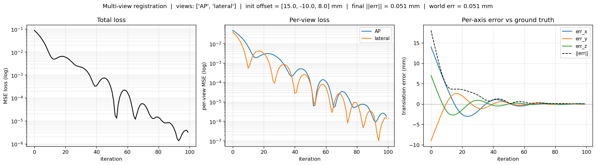

# isaac_roentgen_nav

Fluoroscopy-guided robot pose estimation in Isaac Sim. A virtual surgical scene
with a Franka arm and a CT phantom is imaged by a simulated mobile C-arm;
differentiable DRR registration recovers the anatomy pose from the X-ray
images; the recovered pose is composed with the robot's forward kinematics to
produce **T_robot_in_anatomy** — the transform that intraoperative trajectory
planning would consume.

| Isaac Sim scene | Synthetic X-ray (DRR) | Robot EE in anatomy frame |
|---|---|---|
|  |  |  |

**Current headline results** — two sequential C-arm shots (AP + 90° lateral):

| Volume | Error ‖err‖ | Time |
|---|---|---|
| Synthetic ellipsoid | **0.05 mm** vs Isaac Sim GT | ~10 s |
| Real spine CT — cropped 128 mm³ ROI | **0.037 mm** | 9.4 s |
| Real spine CT — full 797×512×512 scan | **0.085 mm** | 15.6 s |

All on an RTX 4060 Laptop GPU (8 GB VRAM). The full CT fits with room to spare.

---

## Goal

The final deliverable is the spatial transform between the robot end-effector
and the patient anatomy — established entirely through simulated fluoroscopy.
Once this transform is known, the surgeon (or a planner) can:

- Know whether the tool tip is inside or outside the bone core
- Plan a trajectory toward a surgical target ("move 5 mm closer to the spine")
- Track tool drift relative to anatomy across multiple imaging instants

Everything runs in simulation for now; the design is structured so that each
component (Isaac Sim → pose.json → fluorosim → registration → transform
composition) maps directly to its real-OR counterpart.

---

## Pipeline

```
   ┌──────────────────────────────────────────────┐
   │  Isaac Sim  (host, headless)                  │
   │                                              │
   │  Franka arm ─── FK ──► ee_pos, ee_quat       │
   │  Phantom    ─── USD ──► phantom_pos           │
   │  C-arm      ─── set ──► carm_pos              │
   │                                              │
   │  → pose.json  (written each sim step)         │
   └──────────────────┬───────────────────────────┘
                      │
                      ▼
   ┌──────────────────────────────────────────────┐
   │  fluorosim  (Docker, GPU)                    │
   │                                              │
   │  ➊  Paint robot tool into μ-volume           │
   │  ➋  Render AP DRR  (C-arm rotation = 0°)     │
   │  ➌  Rotate gantry 90°                        │
   │  ➍  Render lateral DRR                       │
   │  ➎  Multi-view registration                  │
   │       single shared translation parameter    │
   │       summed MSE + Slang autodiff + Adam      │
   │  → recovered phantom_pos (world frame)        │
   └──────────────────┬───────────────────────────┘
                      │
                      ▼
   ┌──────────────────────────────────────────────┐
   │  Post-processing  (host, pure Python)        │
   │                                              │
   │  T_R^W  ← ee_pos / ee_quat  (FK, always known) │
   │  T_C^W  ← carm_pos / quat   (calibration)    │
   │  T_A^W  ← registered phantom_pos             │
   │                                              │
   │  T_R^A = inv(T_A^W) · T_R^W                   │
   │  T_R^C, T_A^C   (all three transforms)       │
   │  Clinical: EE inside/outside bone core?      │
   └──────────────────────────────────────────────┘
```

`pose.json` carries every world-frame pose (EE, C-arm, phantom) as the IPC
contract between Isaac Sim and the fluorosim container. The registration
recovers `translation_mm = (carm_pos − phantom_pos) × 1000`, which is the
C-arm position in the volume-local frame — the real unknown in any
fluoroscopy-guided procedure.

---

## Clinical faithfulness

> *Are we feeding the registration information that a real OR wouldn't have
> — especially the phantom isocenter pose?*

**Short answer: no.** The `phantom_pos` field in `pose.json` is used in
two roles that are easy to conflate but are distinct:

| Use of `phantom_pos` | Role | Real-life analog |
|---|---|---|
| fluorosim renders target DRRs at this pose | Where the anatomy sits in the simulated world | The physical patient — no "knowledge" required, the X-ray hits it regardless |
| `compute_robot_to_anatomy.py` compares GT vs recovered | Accuracy scoring | An independent precision measurement (optical tracker, CMM) — present only for evaluation |

The optimizer never reads `phantom_pos`. It sees only the CT μ-volume, the
two target images, and an initial translation guess. Convergence to 50 µm is
recovery from the images alone.

Full input audit:

| Input | Sim source | Real-OR source | Realistic? |
|---|---|---|---|
| Robot EE pose | Isaac Sim FK | Joint encoders → FK | ✓ |
| C-arm pose | Set in `pose.json` | Hand-eye calibration C-arm ↔ robot (one-time) | ✓ |
| C-arm gantry angle per shot | Hardcoded 0° / 90° | Gantry encoders | ✓ |
| CT μ-volume | Real DICOM spine CT or synthetic cache | Pre-op CT, segmented HU→μ | ✓ (mechanism identical) |
| Target X-ray | Rendered by fluorosim | Actual X-ray photons | ✓ (same Beer–Lambert physics) |
| Optimizer initial guess | `gt + INIT_OFFSET_MM` | Planning prior or "anatomy at isocenter" | ⚠ uses GT as basis for testing; easily replaced with a fixed prior |
| Ground-truth phantom pose (for scoring) | `pose.json` | Sim-only — NOT used by the optimizer | Validation reference only |

One note on coordinate frames: Isaac Sim uses an arbitrary world frame, but
the Franka sits at the origin, so world ≡ robot-base here. In a real OR
everything would be expressed in robot-base frame using the same math.

---

## Hardware

- NVIDIA RTX 4060 Laptop (8 GB VRAM, CC 8.9), AMD Ryzen 7 7840HS, 32 GB RAM
- Ubuntu 22.04, NVIDIA Driver 590.48, CUDA 13.1 host / 12.6 container

## Software stack

- **Isaac Sim 4.5.0** (standalone at `~/isaacsim/`)
- **fluorosim** (NVIDIA i4h-sensor-simulation) in its own Docker image
- **fluorosim-torch** — derived image (`bridge/fluorosim_torch.Dockerfile`)
  adding PyTorch for the differentiable registration
- Host-side Python: `numpy`, `matplotlib`, `pyzmq`, `Pillow` — see
  [`pyproject.toml`](pyproject.toml)

---

## Installation

```bash
# 1. Install Isaac Sim 4.5.0 standalone (per NVIDIA docs)

# 2. Build fluorosim base image (outside this repo)
mkdir -p ~/nvidia-third-party && cd ~/nvidia-third-party
git clone https://github.com/isaac-for-healthcare/i4h-sensor-simulation.git
cd i4h-sensor-simulation/fluoro-simulator && docker build -t fluorosim .

# 3. Build the torch-enabled derivative (~5 min, one-time)
docker build -t fluorosim-torch \
    -f ~/isaac_projects/bridge/fluorosim_torch.Dockerfile \
    ~/isaac_projects/bridge/

# 4. Install pyzmq into Isaac Sim's embedded Python (not your conda env)
/home/$USER/isaacsim/kit/python/bin/python3 -m pip install pyzmq \
    --target /home/$USER/isaacsim/kit/python/lib/python3.10/site-packages

# 5. Host-side glue
pip install -e .
```

---

## Quick start — full end-to-end

```bash
conda deactivate   # Isaac Sim clashes with conda's site-packages
cd ~/isaac_projects

# Step 1 — build the simulated scene and write pose.json (~25 s)
~/isaacsim/python.sh scenes/robot_scene.py

# Step 2 — sequential AP + lateral registration (~10 s)
bridge/run_register_multiview.sh

# Step 3 — compose T_robot_in_anatomy from registration + FK
python3 bridge/compute_robot_to_anatomy.py
```

`compute_robot_to_anatomy.py` prints the headline result and writes
`output/robot_to_anatomy.json` + `output/robot_to_anatomy_layout.png`.

### Optional: render and inspect the DRR

```bash
bridge/run_fluorosim.sh          # renders DRR with tool painted in
python3 bridge/visualize_drr.py  # annotated PNG + sanity check
```

### Optional: register against a real DICOM CT

```bash
# One-time: build the CT cache (cropped 128 mm³ ROI, ~10 s)
bridge/run_load_ct.sh
# Or the full scan (797×512×512, no resampling, ~20 s)
CT_FULL_VOLUME=1 bridge/run_load_ct.sh

# Run multi-view registration with real CT (USE_POSE_JSON=0 until Isaac Sim
# mesh is updated to match the CT geometry)
DICOM_PATH=~/medical_imaging/spine_mets_ct_seg/10250/04098/27242 \
  USE_POSE_JSON=0 bridge/run_register_multiview.sh
```

### Optional: single-view baseline (for comparison)

```bash
bridge/run_register.sh           # AP only → ~0.4 mm (depth ambiguity present)
python3 bridge/plot_registration.py
```

### Live introspection via Isaac Sim TCP

```bash
# Verify EE pose and phantom prims in a running GUI session
python3 scenes/isaacsim_client.py < scenes/verify_pose.py
python3 scenes/isaacsim_client.py < scenes/verify_phantom.py

# Capture a viewport snapshot
python3 scenes/isaacsim_client.py "$(cat scenes/image_publisher.py)"
python3 scenes/take_snapshot.py my_snapshot.jpg
```

---

## Results

### Multi-view vs single-view

A single AP shot cannot resolve translation along the X-ray beam axis (depth
ambiguity). The 90° lateral shot collapses it:

| Method | x err | y err | **z err** | ‖err‖ |
|---|---|---|---|---|
| Single view (AP only) | 0.04 mm | 0.02 mm | **0.41 mm** | 0.41 mm |
| **AP + Lateral (sequential)** | 0.04 mm | −0.03 mm | **0.01 mm** | **0.05 mm** |

Z is the *most-constrained* axis with two views because it is in-plane in the
lateral view and its gradient is strong there.



### Real CT results

The same multi-view registration runs against a real 797-slice spine CT
(`bridge/ct_loader.py` + `DICOM_PATH` env var):

| CT mode | Volume | ‖err‖ | ms/iter |
|---|---|---|---|
| Cropped ROI | (128,256,256) @ 1×0.5×0.5 mm | **0.037 mm** | 95 ms |
| Full volume | (797,512,512) @ 0.5×0.7×0.7 mm | **0.085 mm** | 156 ms |

Both fit within 8 GB VRAM. The cropped-ROI path gives better accuracy
(the FOV sees only bone; every gradient step is informative); the full-volume
path requires no resampling and produces realistic torso DRRs.

### End-to-end result on a real Isaac Sim scene

```
T_robot_in_anatomy.t  (mm)
         Ground truth:  [  0.623,  15.397,  -2.932 ]
            Recovered:  [  0.659,  15.363,  -2.919 ]
     Per-axis error:    [  0.036,  -0.033,   0.013 ]
         ‖error‖:       0.051 mm

Clinical: Tool tip is INSIDE the bone core (normalized distance 0.77).
```

---

## Project layout

```
isaac_roentgen_nav/
├── scenes/                            # Isaac Sim — scene scripts + host tooling
│   ├── robot_scene.py                 # headless: Franka + phantom, writes pose.json
│   ├── phantom.py                     # shared phantom geometry (single source of truth)
│   ├── verify_pose.py                 # TCP-injected: EE pose vs pose.json
│   ├── verify_phantom.py              # TCP-injected: phantom prim world transform
│   ├── isaacsim_client.py             # TCP client for VSCode extension socket
│   ├── image_publisher.py             # TCP-injected: ZMQ JPEG viewport stream
│   └── take_snapshot.py               # ZMQ subscriber: save one frame
├── bridge/                            # fluorosim side + post-processing
│   ├── fluorosim_render.py            # in-container: pose.json → DRR (tool painted)
│   ├── run_fluorosim.sh               # docker run wrapper
│   ├── visualize_drr.py               # host: annotated viewer + sanity check
│   ├── fluorosim_torch.Dockerfile     # fluorosim + PyTorch 2.5.1+cu121
│   ├── register_phantom.py            # single-view translation registration
│   ├── run_register.sh                # wrapper for single-view
│   ├── plot_registration.py           # host: single-view convergence plots
│   ├── register_phantom_multiview.py  # sequential AP + lateral registration
│   ├── run_register_multiview.sh      # wrapper for multi-view
│   ├── plot_registration_multiview.py # host: per-view losses + image grid
│   ├── compute_robot_to_anatomy.py    # host: registration → T_R^A, T_R^C, T_A^C
│   ├── ct_loader.py                   # DICOM CT → PreprocessedVolume (cropped or full)
│   └── run_load_ct.sh                 # one-time CT cache builder
├── docs/images/                       # committed reference images for this README
├── output/                            # runtime artifacts — gitignored
├── CLAUDE.md                          # detailed implementation log, gotchas
├── pyproject.toml
├── LICENSE                            # Apache-2.0
└── README.md
```

---

## Status

**Done:**

- **Phase 1** — Isaac Sim headless scene; Franka EE pose readable
- **Phase 2** — fluorosim Docker; differentiable DRR at ~150 FPS
- **Phase 2.5** — TCP code-injection + ZMQ viewport snapshot tooling
- **Phase 3** — `pose.json` IPC; full Isaac Sim → fluorosim → DRR loop
- **Phase 4** — Shared phantom geometry; world↔isocenter transform verified
  numerically; robot tool painted into μ-volume and visible in DRR
- **Phase 5** — Translation-only registration; single-view (0.41 mm) and
  multi-view (0.05 mm); `compute_robot_to_anatomy.py` produces T_R^A;
  end-to-end test on a live Isaac Sim scene
- **Phase 5d** — Real DICOM CT integration: `bridge/ct_loader.py` loads a
  797-slice spine CT via SimpleITK; `DICOM_PATH` + `CT_FULL_VOLUME` env vars
  select real CT vs synthetic and cropped vs full volume. Multi-view
  registration on the real CT converges to **~0.1 mm** ‖err‖ in both modes,
  within 8 GB VRAM
- **Phase 5e** — Isaac Sim CT mesh: `bridge/ct_to_mesh.py` extracts a
  triangle mesh from the cached μ-volume (marching cubes + Laplacian
  smoothing), `scenes/robot_scene.py` loads it as a `UsdGeom.Mesh` —
  ellipsoid fallback when the mesh is absent
- **Phase 5f** — Closed `USE_POSE_JSON=1` loop on the CT phantom.
  `compute_robot_to_anatomy.py` now does data-driven inside-bone/soft-tissue
  classification via μ-volume lookup at the EE position; the layout PNG
  shows actual axial+coronal CT slices through the isocenter

**Next:**

- **6-DOF registration** — extend to translation + rotation (phantom
  orientation currently assumed identity)
- **Surgical scene** — operating table, robot platform, lights, C-arm
  model around the existing Franka + CT phantom setup (cosmetic only;
  the math is already closed)
- **Trajectory planning** — consume T_R^A to drive the Franka toward a
  surgical target while maintaining the tool tip inside a safety region

---

## Acknowledgments

- [NVIDIA i4h — Sensor Simulation](https://github.com/isaac-for-healthcare/i4h-sensor-simulation) — fluorosim differentiable DRR renderer
- NVIDIA Isaac Sim 4.5.0 — physics simulation, USD, Franka asset

## License

Apache-2.0. See [LICENSE](LICENSE).
