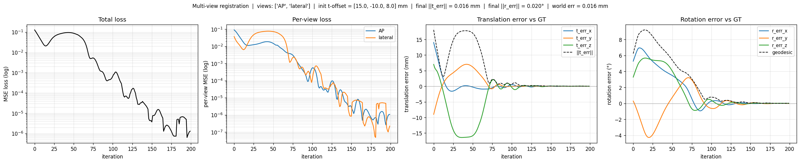
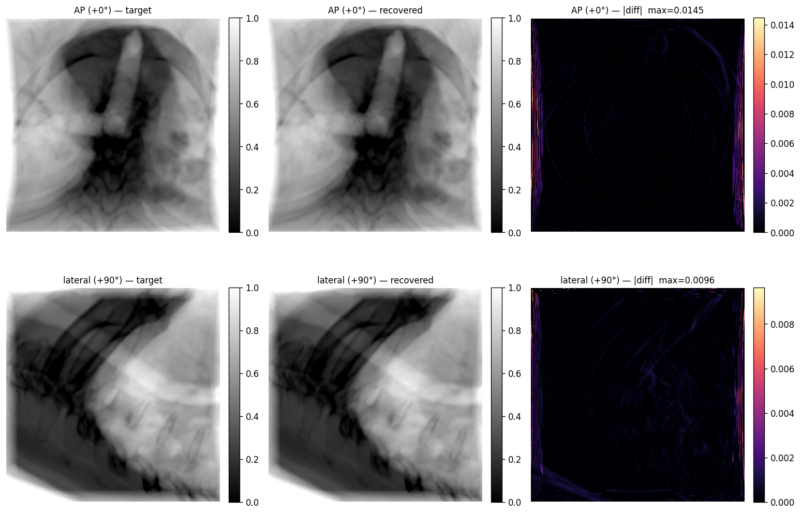
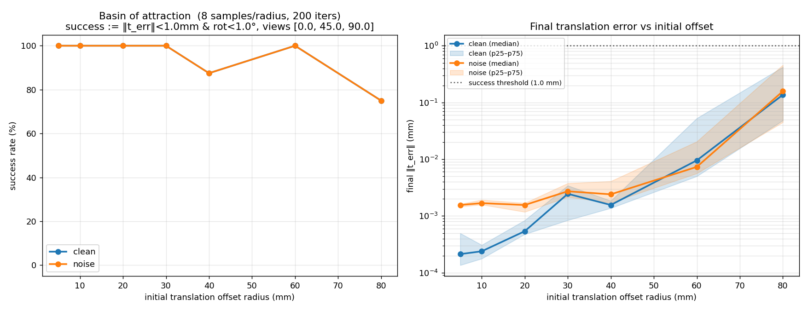
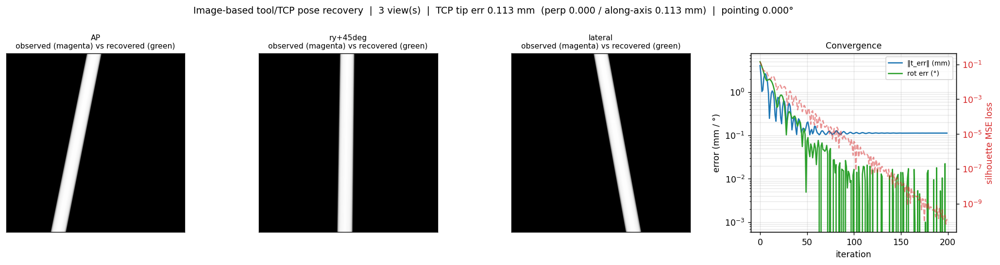

# Validation Record

This is the test log for the fluoroscopy-based robot pose-estimation pipeline —
what was tested, how, the exact configuration, and the measured result. The
[README](../README.md) keeps only a headline summary; this file is the full
record.

Each entry follows the same shape: **Objective → Method → Command → Result →
Status**. Numbers are the measured values from the run on the reference
hardware; commands are runnable as-is (paths assume the layout in the README).

---

## Reference environment

| | |
|---|---|
| GPU | NVIDIA RTX 4060 Laptop, 8 GB VRAM (CC 8.9) |
| CPU / RAM | AMD Ryzen 7 7840HS / 32 GB |
| OS / driver | Ubuntu 22.04, NVIDIA driver ≥ 560 (CUDA ≥ 12.6 for the container) |
| Renderer | fluorosim (differentiable DRR) in the `fluorosim-torch` Docker image (PyTorch 2.5.1 + cu121) |
| CT | Spine mets CT, 797 slices, 512² @ (0.5, 0.703, 0.703) mm; HU→μ via bilinear LUT in `ct_loader.py` |
| Optimizer | Adam, 6-DOF (shared translation + phantom ZXY-Euler rotation), summed mask-weighted MSE across views |

**Coordinate note.** The registration recovers `T_anatomy→C-arm`
(`translation_mm = (carm_pos − phantom_pos)×1000` plus phantom rotation). The
robot EE pose is taken as known (FK); `T_robot→anatomy` is the *composition* of
the registered anatomy pose with that known EE pose. See the README pipeline
section.

**Honesty note (read before trusting the small numbers).** Unless a test says
otherwise, target and optimizer DRRs come from the *same clean renderer* with no
photon noise, scatter, or beam hardening ("inverse crime"). Sub-10 µm errors in
those tests measure *optimizer self-consistency*, not clinical accuracy. Test
[V9](#v9--capture-range--basin-of-attraction-clean-vs-noise) deliberately breaks
this with degraded target images and is the honest headline for
accuracy-under-noise and robustness.

---

## V1 — Projection geometry (world ↔ isocenter ↔ detector)

**Objective.** Confirm the world→volume→detector transform is correct before
trusting any registration result.

**Method.** Shift a known object by a known amount in world space, predict the
detector-plane displacement from the SDD/SID magnification and pixel spacing,
and compare to the measured DRR centroid.

**Results.**

| Test | Input | Prediction | Measured | Status |
|---|---|---|---|---|
| Centering | `carm_pos == phantom_pos` | centroid at (256, 256) px | (256, 256) | ✅ |
| Magnification | phantom +20 mm X | centroid −80 px (2× mag @ 0.5 mm/px) | (176, 256.5) | ✅ |
| Tool projection | EE +30 mm world Y | tool centroid +120 px in detector Y | +121 px | ✅ |

**Status.** ✅ Geometry verified end-to-end (Phase 4).

---

## V2 — Registration convergence (synthetic phantom, single view)

**Objective.** Show the differentiable-DRR + Adam loop converges from a large
initial offset on a controlled synthetic volume.

**Command.** `INIT_OFFSET_MM="…" N_ITERS=100 bridge/run_register.sh`

**Result.** 19.7 mm initial → **0.41 mm** final in 100 iters (5.3 s); loss
reduced 4.7e-2 → 1.6e-6 (≈29 000×). Per-axis error x=0.04, y=0.02, **z=0.41 mm**
— the depth (beam) axis dominates, the known single-view depth ambiguity.

**Status.** ✅ Converges; depth axis is the expected weak direction.

---

## V3 — Single-view vs multi-view (depth ambiguity collapse)

**Objective.** Quantify how a second orthogonal view fixes the single-view depth
weakness from V2.

**Command.** `bridge/run_register_multiview.sh` (default views) vs
`bridge/run_register.sh`.

**Result.**

| Method | x err | y err | **z err** | ‖err‖ |
|---|---|---|---|---|
| Single view (AP) | 0.04 mm | 0.02 mm | **0.41 mm** | 0.41 mm |
| AP + lateral | 0.04 mm | −0.03 mm | **0.01 mm** | **0.05 mm** |

With two views Z becomes the *best*-constrained axis (in-plane in the lateral
view). 8× improvement on ‖err‖.

**Status.** ✅ Multi-view collapses depth ambiguity.

---

## V4 — 6-DOF registration (translation + rotation)

**Objective.** Recover phantom orientation as well as position, on the real
spine CT.

**Command.**
```bash
DICOM_PATH=~/medical_imaging/spine_mets_ct_seg/10250/04098/27242 \
  USE_POSE_JSON=1 INIT_ROT_DEG="5,0,3" N_ITERS=200 \
  bridge/run_register_multiview.sh
```

**Result (real spine CT, 200 iters, 15.2 s / 76 ms per iter):**

| | Init | Final |
|---|---|---|
| Translation ‖err‖ | 19.7 mm | **0.016 mm** |
| Rotation ‖err‖ (geodesic) | 5.83° | **0.020°** |
| Wall time | — | 15.2 s (76 ms/iter) |



*Total MSE loss, per-view loss, translation error per axis, rotation error per
axis. The optimizer oscillates until ~iter 120 as rotation and translation
untangle, then converges sharply.*



*AP (top) and lateral (bottom): target | recovered | |diff|. The |diff| max
(0.015 AP, 0.010 lateral) is near the differentiable renderer's noise floor.*

**Method notes / gotchas** (see CLAUDE.md for detail):
- `matrix_to_euler_zxy` uses `atan2`, not `arcsin` (bounded gradient at gimbal lock).
- Slang's rotation-backward path can emit NaN → detected and zeroed per step.
- The Slang autodiff gradient sign is flipped → negated before `optimizer.step()`.
- 6-DOF needs ~200 iters (rotation-translation coupling) vs ~100 for 3-DOF.

**Status.** ✅ 6-DOF converges to sub-0.02 mm / sub-0.02° with a clean target.

---

## V5 — Real CT integration (cropped vs full volume)

**Objective.** Register against a real DICOM CT, not just synthetic geometry;
compare a cropped ROI to the full volume.

**Command.** add `CT_FULL_VOLUME=1` for the full volume.

**Result.**

| Volume | ‖err‖ | ms/iter | Notes |
|---|---|---|---|
| Cropped 128 mm³ ROI, (128,256,256) @ (1,0.5,0.5) mm | 0.037–0.096 mm | 82 | auto-detected vertebral centre |
| Full 797×512×512 @ native spacing (836 MB, ~1.7 GB VRAM) | 0.076–0.085 mm | 158 | richer lateral-view signal; fits 8 GB |

**Status.** ✅ Both work; full volume gives the depth axis more signal and
shows the tool shaft (see V6). Fits in 8 GB VRAM.

---

## V6 — Tool in the registration target (clinical realism)

**Objective.** Make the target DRRs look like real fluoroscopy (steel tool
occluding anatomy) and confirm the optimizer still matches *anatomy only* via a
tool mask — and that the recovered pose is unaffected.

**Method.** The endo360 tip mesh is extracted from the live scene into an
EE-local μ-stamp (`extract_tool_mesh.py` → `build_tool_stamp.py`), splatted into
the target μ-volume at the EE pose; a tool-only render gives a per-view binary
mask; loss = `((rendered − target)²·(1 − mask)) / anatomy_count`. The optimizer
renderer keeps the *clean* volume (the patient's CT has no tool).

**Result** (live medical scene + full CT, blind 19.7 mm / 5.8° start, 3 views
0/45/90, 200 iters):

| Tool scope | Length | Final ‖t_err‖ | Final ‖r_err‖ | Wall | AP mask |
|---|---|---|---|---|---|
| none | — | 0.0003 mm | 0.000° | 47 s | — |
| real tip + 50 mm shaft | 100 mm | 0.0037 mm | 0.000° | 47 s | 2.4% |
| real tip + 200 mm shaft | 250 mm | 0.0039 mm | 0.000° | 45 s | 3.5% |

Painting a tool costs ~10× in final precision (still well sub-mm) and no wall
time. The tool shaft is only visible against the **full** CT (the cropped ROI
clips it).

**Status.** ✅ Tool-in-target realism added without changing the recovered pose.

---

## V7 — Blind initialization and the need for a third view

**Objective.** Remove any ground-truth leakage from the optimizer's starting
pose (it inits from the C-arm isocenter + a fixed planning offset; GT scores
only), and characterize blind 6-DOF behaviour.

**Method.** On a live scene the C-arm was physically moved +30 mm off the spine
in the GUI, captured to `pose.json`, and registered on the real CT from a
genuinely blind 28 mm start.

**Result.**

| Views | Trans ‖err‖ | Rot ‖err‖ | Outcome |
|---|---|---|---|
| AP + lateral (0°, 90°) | 2.06 mm | 6.15° | **stuck** — in-plane tx↔ry coupling local min |
| AP + oblique + lateral (0°, 45°, 90°) | **0.003 mm** | **0.000°** | clean convergence |

Two orthogonal views leave an in-plane translation↔rotation ambiguity; one
oblique view breaks it. `VIEWS_DEG_Y` therefore defaults to `0,45,90`.

**Status.** ✅ Blind init validated; ≥3 views (one oblique) is the robust
workflow.

---

## V8 — End-to-end deliverable (`T_robot→anatomy` + clinical check)

**Objective.** Produce the actual deliverable transform on a live Isaac Sim
scene and confirm the clinical inside/outside classification.

**Command.** `python3 bridge/compute_robot_to_anatomy.py` after a registration
(or the one-button `bridge/register_oneshot.py`).

**Result (live scene, multi-view):**
```
T_robot_in_anatomy.t (mm)   GT: [ 0.623, 15.397, -2.932]
                     Recovered: [ 0.659, 15.363, -2.919]
                        ‖error‖: 0.051 mm
Clinical: Tool tip INSIDE the bone core (normalized distance 0.77).
```
The deliverable figure `output/robot_to_anatomy_layout.png` overlays the
estimated tool (green/cyan) on the ground-truth tool (red) across axial/coronal/
sagittal CT slices; at this accuracy they coincide.

**Status.** ✅ End-to-end deliverable verified on live scene data.

---

## V9 — Capture range / basin of attraction (clean vs noise)

**Objective.** Measure how far the optimizer's starting guess can be from the
true pose and still converge (the basin of attraction), and how realistic
fluoroscopy noise shrinks that basin and degrades accuracy. This is the honest
robustness number and the key input for the real-time tracking goal (each frame
inits from the previous frame → small offset).

**Method.** With the true pose fixed, place the optimizer's init at controlled
distances (radii 5–80 mm) from GT, 8 random directions per radius (+5° rotation
perturbation), and run the full 200-iter 6-DOF registration from each.
Success := ‖t_err‖ < 1 mm AND geodesic rot err < 1°. Repeat with **clean**
target DRRs and with **noisy** targets (`DRR_NOISE=1`: Poisson photon noise at
10 000 photons/px + 0.7 px PSF blur) — the optimizer's own renderer stays clean,
so the noisy target is no longer exactly reproducible (breaks the inverse
crime).

**Command.**
```bash
# clean
DICOM_PATH=… USE_POSE_JSON=1 USE_CARM_ROTATION=1 N_ITERS=200 \
  CAPTURE_RANGE=1 CR_TRANS_RADII_MM="5,10,20,30,40,60,80" CR_N_SAMPLES=8 \
  CR_ROT_OFFSET_DEG=5 CR_SUCCESS_MM=1.0 CR_SUCCESS_DEG=1.0 CR_SEED=0 \
  bridge/run_register_multiview.sh
# noisy: add  DRR_NOISE=1 DRR_PHOTON_COUNT=10000 DRR_BLUR_SIGMA_PX=0.7 DRR_NOISE_SEED=0
python3 bridge/plot_capture_range.py     # overlays capture_range_{clean,noise}.json
```

**Result** (2026-07-02; 8 samples/radius, 200 iters, views 0/45/90; noise =
10 000 photons/px + 0.7 px PSF blur):

| Init radius | Clean success | Clean median ‖err‖ | Noise success | Noise median ‖err‖ |
|---|---|---|---|---|
| 5 mm | 8/8 (100%) | 0.000 mm | 8/8 (100%) | 0.002 mm |
| 10 mm | 8/8 (100%) | 0.000 mm | 8/8 (100%) | 0.002 mm |
| 20 mm | 8/8 (100%) | 0.001 mm | 8/8 (100%) | 0.002 mm |
| 30 mm | 8/8 (100%) | 0.002 mm | 8/8 (100%) | 0.003 mm |
| 40 mm | 7/8 (88%) | 0.002 mm | 7/8 (88%) | 0.002 mm |
| 60 mm | 8/8 (100%) | 0.010 mm | 8/8 (100%) | 0.007 mm |
| 80 mm | 6/8 (75%) | 0.137 mm | 6/8 (75%) | 0.158 mm |



*Left: success rate vs initial offset (clean and noise curves overlap almost
exactly). Right: median final ‖t_err‖ + p25–p75 band, log scale; noise adds a
small ~1.5 µm accuracy floor at small radii but the two converge at larger
offsets.*

**Findings.**
- **Reliable capture range ≈ 60 mm.** 100% convergence out to 30 mm, and again
  at 60 mm; the dips at 40 mm (7/8) and 80 mm (6/8) are *direction-dependent*
  failures where the random init hits the in-plane tx↔ry coupling (V7), **not**
  noise — the failing sample count is identical clean vs noise.
- **Noise (10 000 photons/px) barely affects the basin.** The success curves are
  effectively identical; noise only raises the median accuracy floor from
  sub-µm to ~2–3 µm. At this dose the basin is geometry-limited, not
  noise-limited.
- **Implication for tracking.** mm-scale frame-to-frame offsets (the tracking
  regime, where each frame inits from the previous pose) converge at 100% with
  microns of error even under noise — the small-offset regime is rock solid.

**Status.** ✅ Basin characterized; robust to realistic detector noise at this dose.

---

## V10 — Image-based tool/TCP pose recovery (proof-of-concept)

**Objective.** Recover the tool/TCP pose from its own fluoroscopy silhouette —
*independent of the robot FK* — so it can later cross-check or replace the FK /
hand-eye-calibration term (which V8 / simplification #4 currently take as exact).

**Method.** Render the endo360 tool stamp (`output/tool_stamp.npy`) as its own
differentiable volume and optimize its 6-DOF pose (translation + ZXY-Euler
rotation in the C-arm base frame) to match the observed tool silhouette across
views — the same per-view gantry composition and Adam loop as the anatomy
registration, with the tool as the object. The observed silhouette is the stamp
rendered at the GT pose (`normalize=False` → transmittance `T=exp(−∫μ)`); loss is
summed silhouette MSE. Init = FK prior + a residual perturbation (a thin rod has
a small basin, so this *refines* an approximate pose rather than searching
globally). GT scores only.

**Command.** `bridge/run_register_tool.sh` (self-contained — needs only the tool
stamp + GPU; no CT).

**Result** (GT tool pose in-frame; init = FK prior + 5.8 mm / 5.6°; 200 iters):

| Views | TCP tip ‖err‖ | perp-to-axis | along-axis | pointing err | roll |
|---|---|---|---|---|---|
| AP + 45° + lateral | **0.113 mm** | 0.000 mm | 0.113 mm | **0.000°** | 0.000° |
| AP only | 3.23 mm | 0.35 mm | 0.48 mm | 1.28° | — |



*Per-view observed (magenta) vs recovered (green) tool silhouettes — they
coincide (white) — plus convergence. The tool projects to a thin bar at a
different angle in each view.*

**Findings.**
- **The observable DOFs are recovered essentially perfectly** — perpendicular
  position 0.0001 mm and pointing direction 0.0001° (multi-view). Depth is
  collapsed by multiple views, exactly as for anatomy (V3): a single view gives
  3.2 mm tip / 1.28° pointing.
- **Two DOFs are weakly constrained, by the rod geometry** — rotation about the
  tool's long axis (roll) and translation *along* it. The entire multi-view tip
  residual (0.113 mm) is along-axis; it is bounded only by the asymmetric bullet
  tip. These are physical ambiguities of a near-uniform rod, not bugs.
- **Implementation note:** the transmittance silhouette loss (`normalize=False`,
  `invert=False`) does **not** need the Slang gradient sign-flip that the anatomy
  `normalize=True`/`invert=True` path requires (`FLIP_GRAD=0`); with the flip it
  diverges.

**Status.** ✅ PoC — the mechanism works: image-based tool pose recovered to
sub-0.12 mm / sub-0.001° in the observable DOFs. Follow-ons (out of scope here):
confidence metric + FK-fallback fusion, live re-posed medical-scene validation,
and re-using `DRR_NOISE` for an honest noisy target.

---

## Known simplifications (what is not yet real)

| # | Simplification | State |
|---|---|---|
| 1 | Tool absent from the target image | ✅ Closed (V6) |
| 2 | Optimizer init derived from GT | ✅ Closed (V7 — blind init) |
| 3 | Inverse crime + noise-free DRRs | ⚠️ Mitigated (V9 `DRR_NOISE`), not fully closed — degradation is phenomenological (applied in image space), and target + optimizer still share the same forward projector. A full fix renders the target with an independent forward model. |
| 4 | FK / hand-eye calibration error | ⚠️ Not modelled — EE pose is taken as exact. In reality FK and C-arm↔robot calibration add to the `T_robot→C-arm` term. **V10** is the first step toward removing this: an image-based tool pose recovered from the fluoroscopy silhouette, independent of FK (PoC done; fusion/fallback pending). |

---

## Test index

| ID | What | Status |
|---|---|---|
| V1 | Projection geometry | ✅ |
| V2 | Convergence (synthetic, single view) | ✅ |
| V3 | Single- vs multi-view depth ambiguity | ✅ |
| V4 | 6-DOF (translation + rotation) | ✅ |
| V5 | Real CT (cropped vs full) | ✅ |
| V6 | Tool in target (clinical realism) | ✅ |
| V7 | Blind init + third view | ✅ |
| V8 | End-to-end `T_robot→anatomy` | ✅ |
| V9 | Capture range (clean vs noise) | ✅ |
| V10 | Image-based tool/TCP pose recovery (PoC) | ✅ |
